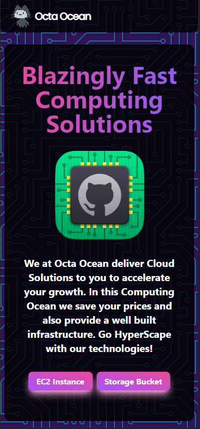
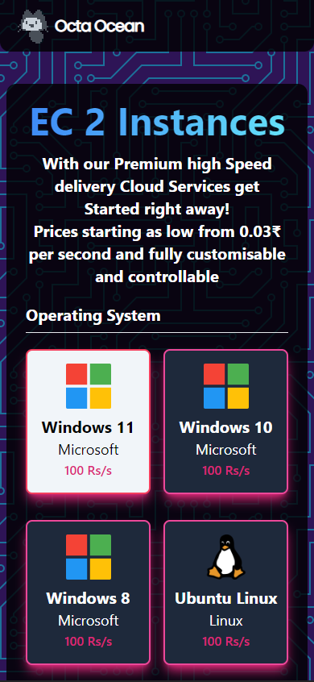

# Cloud Inventory Management
A part of DBMS mini project, this project was made so that I can understand the working of SQL (Sequel) Database. So, as the topic tells, it is managing cloud inventory such as Virtual Machines Instances and also storage buckets for users. 
Used Github's OctaCat as my frontend webpage logo and named **OctaOcean** (like Digital Ocean 😅)

## Tech Stack
This is my tech stack used, React and Tailwind CSS for beautiful frontend which is responsive to mobile and desktop devices, Node JS and Express JS to start my server and also connect to the frontend, finally the database MySQL! the traditional old SQL!

## Screenshots

## How to Start?
To start the Frontend or Website

    npm install
    >> npm run start
To start the Backend or NodeJS (Make sure that nodemon is installed)

    npm install
    >> nodemon index.js
And start the MySQL server on the localhost 

#### Note : Still Working Out!
